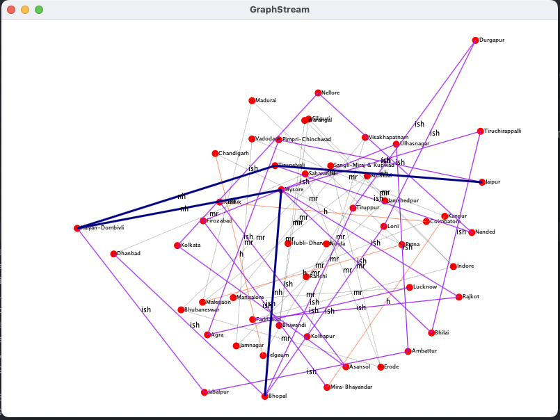

# graph-assessment
- This code uses backtracking
- connected components CC's are created based on the number of national highways
- then the CC's are connected to each other through national highway.
e.g national highways = 4, make 5 connected components then connect them together
- Multiple retries are made to generate the graph.

# 50 cities, 115 lanes, 4 NH
