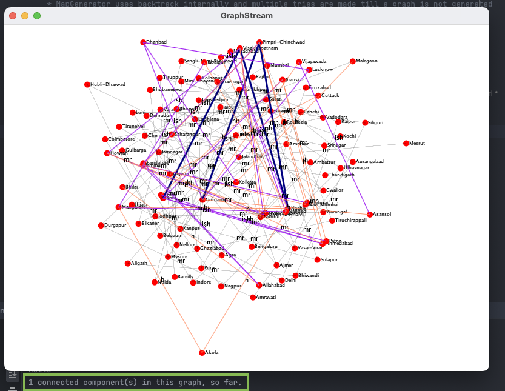

# graph-assessment
- This code uses two approaches backtracking and dp with bit masking ( to remember all the state of connected component given the no. of lanes)
- connected components CC's are created based on the number of national highways
- then the CC's are connected to each other through national highway.
e.g national highways = 4, make 5 connected components then connect them together
- Multiple retries are made to generate the graph.

- Backtracking with DpBitMask

- Backtracking ( has some bugs )

